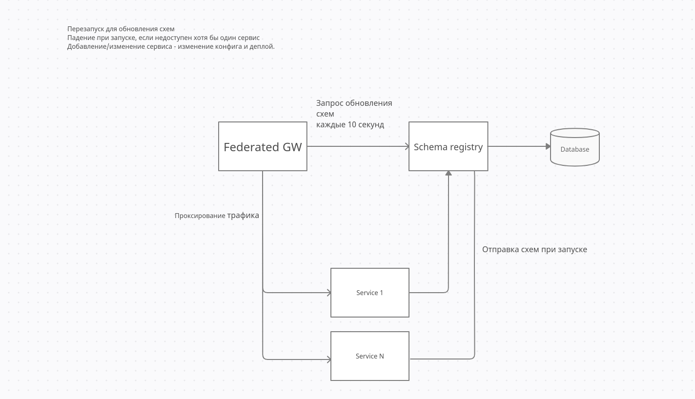

# federation2.0

Для работы федерации необходимо задать переменные среды

PORT=8200  порт на котором будет запущена федерация

SCHEMA_REGESTRY_HOST='localhost' хост сервиса реестр схем

SCHEMA_REGESTRY_PORT=8305 порт сервиса реестр схем

SCHEMA_REGESTRY_URL='/schema' url сервиса реестр схем