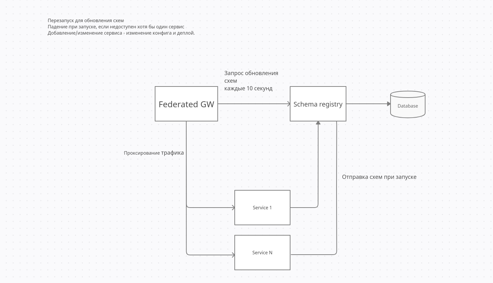

# schema_registry
schema_registry

## ER-диаграмма
[PDF](./docs/erd.pdf)
# Назначение
Получает и хранит graphql схемы, расположение сервисов. Отдает эту информацию федерации по запросу.
### Описание запросов
host - host в сети докера.
serviceName - уникальное имя сервиса.
graphqlSchema - sdl схема, получаемая методом get_sdl(schema, custom_entities) библиотеки kt-graphene-federation>=0.1.1.5 
### Пример реализации подключения сервиса
[controlinfra_service](http://git.int.kronshtadt.ru/center_m/services/infrastructure_services/controlinfra_service/-/blob/devel/controlinfra/utils/federation_registration.py)

### Валидатор
Валидатор в текущей реализации проверяет:
1) Существование extend связей по external связям сервиса.
2) Уникальность названия квери и мутаций.
Если схема не валидна, то при мутации, кроме прочих полей, отправляется `validation_errors`.
Если валидна, то  `validation_errors = null`


## Мутация на валидацию схемы сервиса
```
mutation{
  ValidateServiceSchema(input: {
    serviceName: "event_control"
    fields: [InputField]  # Все поля схемы
    operations: [InputOperations] # Все операции схемы
  }){
    validation_errors
  }
}
```
В ответе приходит строка с ошибками валидации, либо пустая строка
## Мутация на создание или обновление схемы
При этом так же происходит валидация схем
```
mutation{
  CreateOrUpdateSchemaService(input: {
    host: "event_control"
    endpoint: "/graphql"
    port: 8385
    serviceName: "event_control"
    graphqlSchema: "sdl schmea"
  }){
    schema {
      id
      serviceName
      port
      host
      status
      graphqlSchema
      created
      lastUpdate
      deleted
    }
    clientMutationId
  }
}
```
Ответ
###
```
{
  "data": {
    "CreateOrUpdateSchemaService": {
      "schema": {
        "id": "be944be2-3c03-4968-8f7a-6f5d491af52c",
        "serviceName": "event_control",
        "port": 8385,
        "host": "event_control",
        "status": 1,
        "graphqlSchema": "sdl schmea",
        "created": "2020-12-28T10:44:01.503625",
        "lastUpdate": "2020-12-28T10:44:01.503658",
        "deleted": null
      },
      "clientMutationId": null
    }
  }
}
```
## Квери на получение sdl схем
```
query{
  allSchemas{
    id
    serviceName
    port
    host
    endpoint
    status
    graphqlSchema
    created
    lastUpdate
    deleted
  }
}
```
### Ответ
```
{
  "data": {
    "allSchemas": [
      {
        "id": "be944be2-3c03-4968-8f7a-6f5d491af52c",
        "serviceName": "event_control",
        "port": 8385,
        "host": "event_control",
        "endpoint": "/graphql"
        "status": 1,
        "graphqlSchema": "sdl schmea",
        "created": "2020-12-28T10:44:01.503625",
        "lastUpdate": "2020-12-28T10:44:01.503658",
        "deleted": null
      }
    ]
  }
}
```
## GET запрос на получение sdl схем http://schema_registry:8305/schema
Ответ
```
{
    "data": [
        {
            "host": "event_control",
            "endpoint": "/graphql"
            "port": 8385,
            "graphql_schema": "sdl schmea",
            "service_name": "event_control"
        }
    ]
}
```